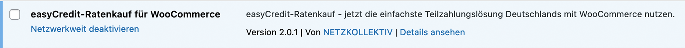
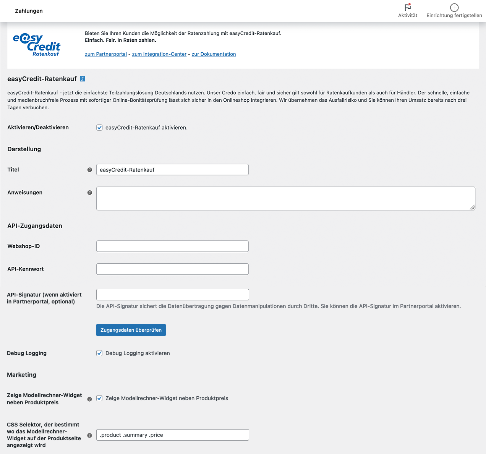
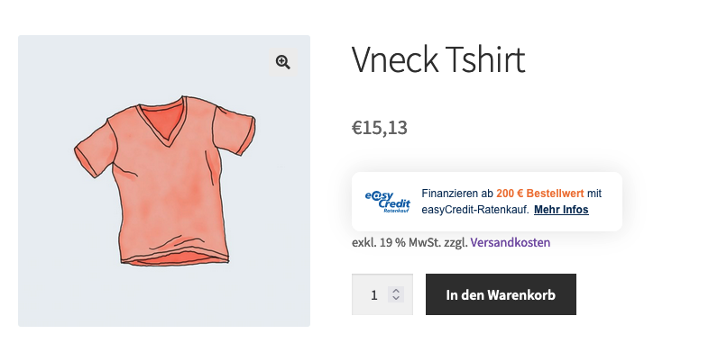
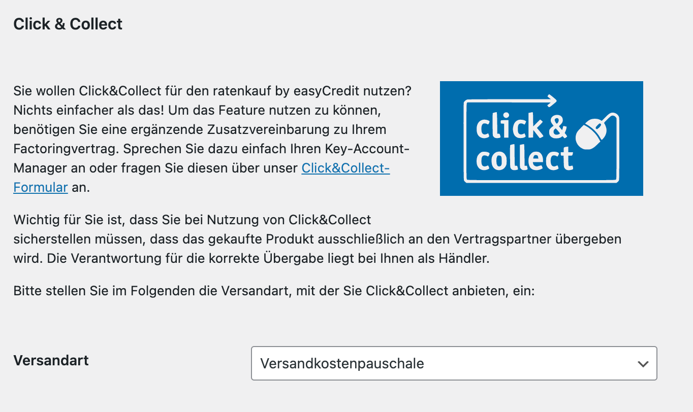

.. role:: latex(raw)
   :format: latex

.. _configuration:

Konfiguration
=============

Zur Konfiguration des Plugins navigieren Sie erneut zu :menuselection:`Plugins`. Klicken Sie dort auf :menuselection:`Einstellungen`.

Alternativ erreichen Sie die Zahlungsarten-Konfiguration unter :menuselection:`wooCommerce --> Einstellungen --> Zahlungsarten`. In der Liste der installierten Plugins sollte nun **easyCredit-Ratenkauf** enthalten sein. Klicken Sie dort auf *Verwalten*

API-Zugangsdaten konfigurieren
-------------------------------

* Aktivieren Sie die Zahlungsart.
* Tragen Sie die Zugangsdaten in die dafür vorgesehenen Felder *Webshop-ID* und *API-Passwort* ein.
* Testen Sie die Zugangsdaten mit Klick auf *Zugangsdaten testen*.
* Nach dem erfolgreichen Test klicken Sie auf *Speichern*.

Widget konfigurieren
---------------------

Um easyCredit-Ratenkauf bei Ihren Kunden zu bewerben, blendet die Extension ein Widget auf der Produktdetailseite und unterhalb des Warenkorbs ein. Das Widget kann über die CSS-Selektoren unter Erweiterte Einstellungen entsprechend des verwendeten Templates positioniert werden. Ein Beispiel für das Widget sehen Sie im folgenden Beispiel:

.. note:: Das Widget wird nur für Artikel angezeigt, deren Preis innerhalb der Betragsgrenzen von easyCredit-Ratenkauf liegen.

Bestellbearbeitung
------------------

Zur komfortablen Verwaltung ihrer Transaktionen können Sie das Plugin unter *Bestellbearbeitung* so konfigurieren, dass der Bestellstatus für Bestellungen mit einem bestimmten Status an easyCredit-Ratenkauf gemeldet wird.
Weitere Details dazu finden Sie unter :ref:`usage-merchant`.

Click & Collect konfigurieren
------------------------------

Um *Click & Collect* für eine Versandart zu aktivieren, kann diese als *Click & Collect*-Versandart ausgewählt werden. Wählt der Kunde diese Versandart im Bezahlvorgang aus, wird dies bei der Finanzierungsanfrage entsprechend übertragen. Weitere Informationen finden Sie unter `Click & Collect <https://www.easycredit-ratenkauf.de/click-und-collect/>`_

