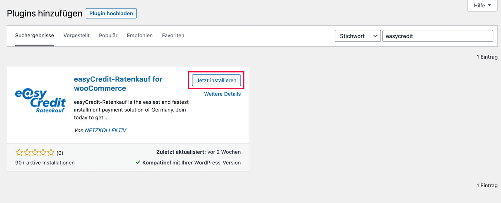
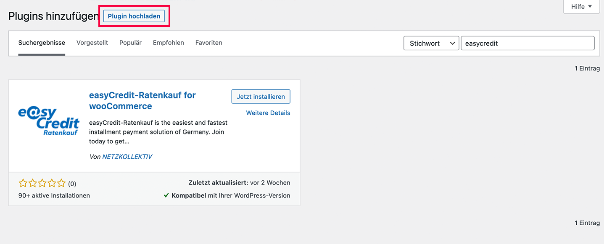

.. role:: latex(raw)
   :format: latex

Installation
============

Das Plugin für easyCredit-Ratenkauf kann im Bereich der Plugins entweder über den direkten Download aus dem *Wordpress Plugin-Verzeichnis* oder über den Datei-Upload des bereitgestellten Archives über *Plugin Hochladen* installiert werden.
Alternativ ist auch die Installation über die Kommandozeile z.B. über WP-CLI möglich.

Wordpress Plugin-Verzeichnis
-----------------------------

Zu Installation melden Sie sich im Admin Panel Ihrer Wordpress Installation an. Sie finden das Admin Panel unter der folgenden URL: ``http(s)://mein-shop.tld/wp-admin``.
Öffnen Sie im Admin Panel nun den Plugin Bereich durch Klick im Menü auf :menuselection:`Plugins`. Klicken Sie neben der Überschrift auf den Button :menuselection:`Installieren`. Sie finden das Plugin, indem Sie in Suche oben rechts **easyCredit** eingeben:

Installieren Sie das Plugin nun durch Klick auf *Jetzt installieren*. Fahren Sie anschließend mit der :ref:`configuration` fort.

manueller Datei-Upload
---------------------------------

Gehen Sie analog zur Installation über das Plugin-Verzeichnis vor. Um das Plugin manuell hochzuladen, klicken Sie auf den Button *Plugin hochladen*. Wählen Sie den lokalen Pfad aus, unter dem sich das ZIP-Archiv des WooCommerce Plugins befindet und klicken Sie anschließend auf *Jetzt installieren*. Fahren Sie anschließend mit der :ref:`configuration` fort.

Kommandozeile
-------------

Um das Plugin über die Kommandozeile zu installieren, führen Sie die folgenden Befehle aus:

.. code-block:: console

    $ wp plugin install https://downloads.wordpress.org/plugin/wc-easycredit.1.6.6.zip
    $ wp plugin activate wc-easycredit

Fahren Sie anschließend mit der :ref:`configuration` fort.