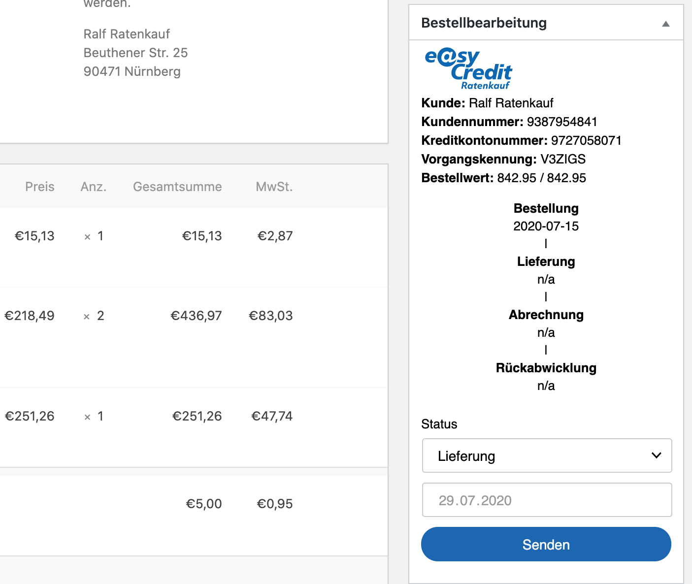
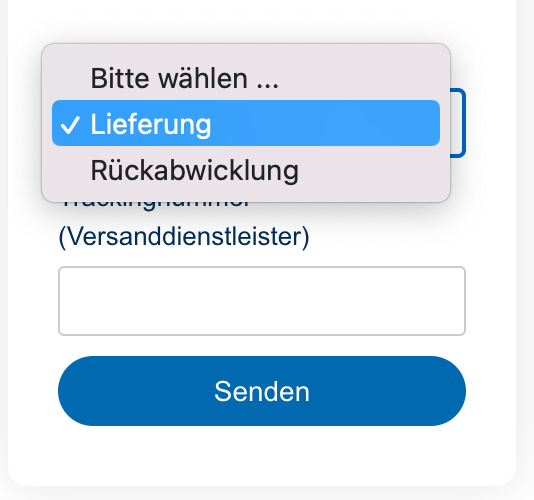

.. _usage_merchant:

======================
Verwendung für Händler
======================

Eine neue Bestellung eines Kunden ist nach ihrem Eingang in WooCommerce gegenüber easyCredit-Ratenkauf genehmigt. Das heisst, die Zahlung und Bestellung wurde von easyCredit-Ratenkauf gegenüber dem Kunden bestätigt. Eine Auszahlung durch easyCredit-Ratenkauf an den Händler erfolgt erst, wenn der Händler die Lieferung der bestellten Artikel gemeldet hat. Dies erfolgt in WooCommerce entweder durch eine Bestätigung über die Transaktionsverwaltung oder durch eine Änderung des Bestellstatus gemäß folgender Einstellungen.

Alternativ ist die weitere Verwaltung des Transaktionsstatus über das `Partnerportal <https://partner.easycredit-ratenkauf.de/portal/>`_ möglich.

Transaktionsmanager
-------------------

Der Transaktionsmanager in der Detailansicht einer mit easyCredit-Ratenkauf bezahlten Bestellung zeigt eine Übersicht über die zur Bestellung gehörende Zahlungstransaktion und deren Historie. Über den Transaktionsmanager kann der Transaktionsstatus aus der Wordpress Administration heraus direkt an easyCredit-Ratenkauf gemeldet werden.

Statusmeldung über den Transaktionsmanager
~~~~~~~~~~~~~~~~~~~~~~~~~~~~~~~~~~~~~~~~~~~~~~~~

Zur Meldung des Transaktionsstatus wählen Sie den gewünschten Status und senden Sie das Formular ab. Sie haben zusätzlich die Möglichkeit eine Versand-Trackingnummer anzugeben. Der Transaktionsmanager aktualisiert nach Absenden die Historie und die Transaktionsdetails oberhalb. Bei Rückabwicklung wählen haben Sie die Möglichkeit den Betrag bei einer teilweisen Rückabwicklung zu reduzieren (z.B. im Falle von Minderung).

Statusmeldung über die Bestellverarbeitung
----------------------------------------------------

Neben der expliziten Meldung über den :ref:`Transaktionsmanager` integriert das Plugin die Statusmeldung auch in die Bestellverarbeitung von wooComnmerce. Bei der Änderung des Bestellstatus meldet das Plugin den Status implizit je nach Einstellung im Plugin.

Lieferung melden
~~~~~~~~~~~~~~~~~~~~~~~~~~~~~~~~~~~~~~~~~~~~~~~~

Wird der Status einer Bestellung in WooCommerce auf den eingestellen Status verändert, wird die Transaktion als "ausgeliefert" an easyCredit-Ratenkauf gemeldet. Die Änderung ist im Transaktionsmanager ersichtlich.

.. note:: Die automatische Meldung entspricht dem Status "Lieferung melden" über den Transaktionsmanager.

Rückabwicklung
~~~~~~~~~~~~~~~~~~~~~~~~~~~~~~~~~~~~~~~~~~~~~~~~

Wird der Status einer Bestellung in WooCommerce auf den eingestellen Status verändert, wird die Transaktion widerrufen bzw. rückgängig gemacht und an easyCredit-Ratenkauf gemeldet. Die Änderung ist im Transaktionsmanager ersichtlich.

.. note:: Die automatische Meldung entspricht dem Status "Widerruf vollständig" über den Transaktionsmanager.

Anzeige des Transaktionsstatus
--------------------------------------

Der Transaktionsstatus kann einen der folgenden Werte annehmen:

* Wartend: die Transaktion ist noch nicht verfügbar. Es kann bis zu einem Tag dauern bis die Transaktion verfügbar ist.
* Lieferung melden: Die Transaktion ist vorhanden. Die Lieferung kann gemeldet werden.
* In Abrechnung: Die Lieferung wurde gemeldet. Die Auszahlung an den Händler wird bearbeitet.
* Abgerechnet: Die Auszahlung an den Händler ist erfolgt.
* Rückerstattet: Die Transaktion wurde widerrufen.
